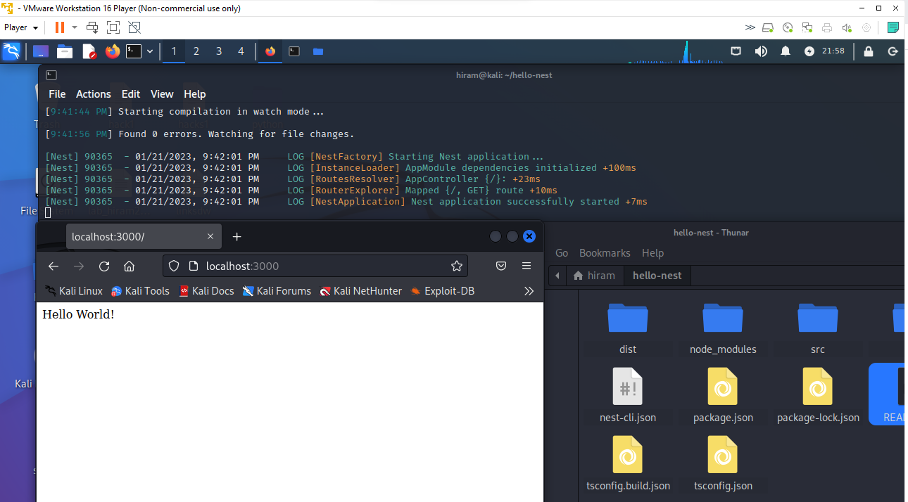

# Nest js
#
## What is Nest js?
### NestJS is a Node. js framework for building server-side applications. It is based on TypeScript and JavaScript. 
### Nest. js is a server-side Node. js framework that's great for building highly testable and maintainable backend applications. 
#
## What is Node js?
### Node. js (Node) is an open source, cross-platform runtime environment for executing JavaScript code. 
### Node is used extensively for server-side programming,making it possible for developers to use JavaScript for client-side and server-side.
### Should You Know JavaScript Before Node js? The short answer is yes, you need to learn JavaScript in order to use Nodejs. 
### Nodejs is a toolkit built around JavaScript and all of the code you will be writing will be in JavaScript. 
### If you don't know anything about JavaScript, this is going to be very challenging.
#
## What is Typescript?
### TypeScript extends JavaScript and improves the developer experience. It enables developers to add type safety to their projects. 
### Moreover, TypeScript provides various other features, like interfaces, type aliases, abstract classes, function overloading, tuple, generics, etc.
#
## How to install NestJs
### Step 1:Install NodeJS
### Step 2:
#
## Installl NodeJS
### sudo apt-get install -y nodejs
### node --version
### npm --version
#
## Install CLI
###  sudo npm i -g @nestjs/cli
### nest -v
#
## Install Postman
### curl -o- "https://dl-cli.pstmn.io/install/linux64.sh" | sh
### postman
#
## Install Docker
### sudo apt update
### sudo apt install apt-transport-https ca-certificates curl software-properties-common
### curl -fsSL https://download.docker.com/linux/ubuntu/gpg | sudo apt-key add -
### sudo add-apt-repository "deb [arch=amd64] https://download.docker.com/linux/ubuntu focal stable"
### apt-cache policy docker-ce
### sudo apt install docker.io
### docker -v
### sudo systemctl status docker
#
## Hello world in NestJS
### nest new helloNest
### npm install -g typescript
### cd hello-nest
### nest start --watch
### open localhost:3000 on the browser or http://localhost:3000/

#
## Links
### https://kinsta.com/blog/how-to-install-node-js/
### https://haquemousume.medium.com/how-to-run-postman-requests-tests-from-command-line-newman-f012afb06564
### https://www.digitalocean.com/community/tutorials/how-to-install-and-use-docker-on-ubuntu-20-04
### https://www.simplilearn.com/tutorials/docker-tutorial/how-to-install-docker-on-ubuntu
### https://www.npmjs.com/package//typescript
### https://www.youtube.com/watch?v=iRPBC6tLrl8&list=PLzHaXzj_WAym4WR3gBYuy1iew5T3NgL0v&index=15
